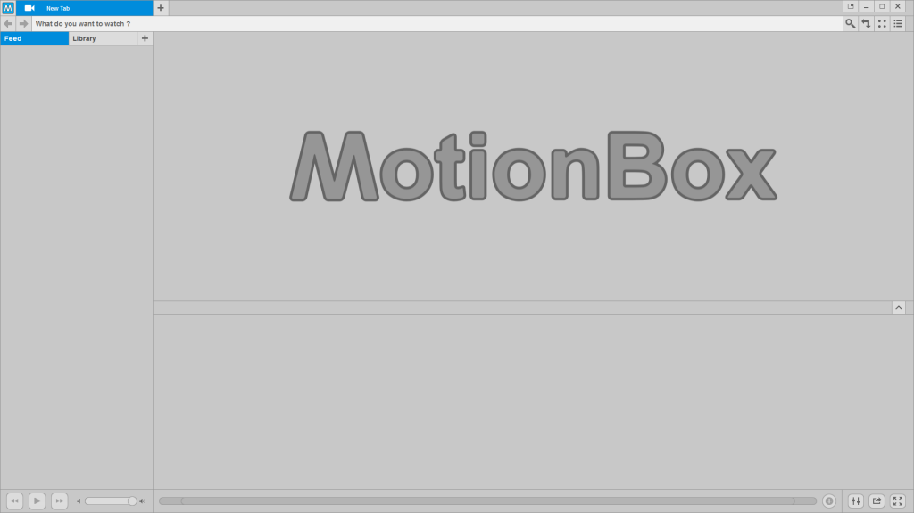

---

Sky is an application kit designed for multimedia software. 
Built for efficiency, scalability and simplicity. 
[omega](http://omega.gg/about) is building Sky kit to empower people. 

## Technology

Sky is built in C++ on the [Qt framework](http://github.com/qtproject). 
The GUI is powered by [QML](http://github.com/qtproject/qtdeclarative) and rendered with OpenGL. 
The video player is based on [VLC](http://github.com/videolan/vlc) and [libtorrent](http://en.wikipedia.org/wiki/libtorrent). 

## Platforms

- Windows XP and later.
- macOS 64 bit.
- Linux 32 bit and 64 bit.
- Android 32 bit and 64 bit.

## Requirements

- [Qt](http://download.qt.io/official_releases/qt) 4.8.0 / 5.5.0 or later.
- [VLC](http://download.videolan.org/pub/videolan/vlc) 2.2.0 or later.
- [libtorrent](http://github.com/arvidn/libtorrent/releases) 1.1.0 or later.
- [Boost](http://www.boost.org/users/download) 1.55.0 or later.
- [OpenSSL](http://www.openssl.org/source) / [Win32OpenSSL](http://slproweb.com/products/Win32OpenSSL.html) 1.0.1 or later.

On Windows:
- [MinGW](http://sourceforge.net/projects/mingw) or [Git for Windows](http://git-for-windows.github.io) with g++ 4.9.2 or later.

Recommended:
- [Qt Creator](http://download.qt.io/official_releases/qtcreator) 3.6.0 or later.

## Install

You can install third party libraries with:

    sh 3rdparty.sh <win32 | win64 | macOS | linux | android>

## Configure

You can configure Sky with:

    sh configure.sh <qt4 | qt5 | clean> <win32 | win64 | macOS | linux>

## Build

You can build Sky with Qt Creator:
- Open [Sky.pro](Sky.pro).
- Click on "Build > Build all".

Or the build script:

    sh build.sh <qt4 | qt5 | clean> <win32 | win64 | macOS | linux> [deploy | tools]

Or the console:

    qmake -r
    make (mingw32-make on Windows)

## Deploy

You can deploy Sky with:

    sh deploy.sh <qt4 | qt5 | clean> <win32 | win64 | macOS | linux> [tools]

## License

Copyright (C) 2015 - 2020 Sky kit authors united with [omega](http://omega.gg/about).

### Authors

- Benjamin Arnaud aka [bunjee](http://bunjee.me) | <bunjee@omega.gg>

### GNU General Public License Usage

Sky kit may be used under the terms of the GNU General Public License version 3 as published
by the Free Software Foundation and appearing in the LICENSE.md file included in the packaging
of this file. Please review the following information to ensure the GNU General Public License
requirements will be met: https://www.gnu.org/licenses/gpl.html.
