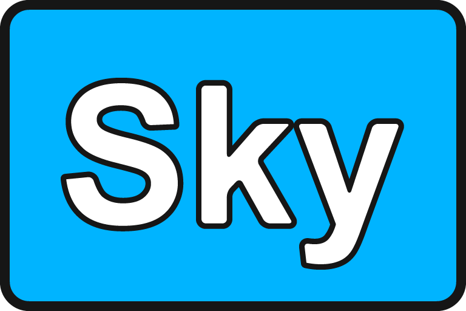

---

Sky is an application kit designed for multimedia software. 
With a focus on efficiency, scalability and simplicity. 
[omega](https://omega.gg/about) is building Sky kit to empower people. 

## Projects

- [MotionBox](https://omega.gg/MotionBox/sources) - Video Browser
- [MotionMonkey](https://omega.gg/MotionMonkey) - Semantic Player
- [tevolution](https://omega.gg/tevolution) - Remote Video Screen
- [clientVBML](https://omega.gg/clientVBML/sources) - VBML retriever and extractor
- [HelloConsole](https://omega.gg/HelloConsole/sources) - "Hello World" console application
- [HelloSky](https://omega.gg/HelloSky/sources) - "Hello World" application

## Technology

Sky is built in C++ on the [Qt framework](https://github.com/qtproject). 
The GUI is powered by [QML](https://github.com/qtproject/qtdeclarative) and rendered with OpenGL. 
The video player is based on [VLC](https://github.com/videolan/vlc) and [libtorrent](https://en.wikipedia.org/wiki/libtorrent). 

## Platforms

- Windows XP and later.
- macOS 64 bit.
- iOS 64 bit.
- Linux 32 bit and 64 bit.
- Android 32 bit and 64 bit.

## Requirements

- [Qt](https://download.qt.io/official_releases/qt) 4.8.0 / 5.5.0 or later.
- [VLC](https://download.videolan.org/pub/videolan/vlc) 2.2.0 or later.
- [libtorrent](https://github.com/arvidn/libtorrent/releases) 1.1.0 or later.
- [Boost](https://www.boost.org/users/download) 1.55.0 or later.
- [OpenSSL](https://www.openssl.org/source) / [Win32OpenSSL](https://slproweb.com/products/Win32OpenSSL.html) 1.0.1 or later.

On Windows:
- [MinGW](https://sourceforge.net/projects/mingw) or [Git for Windows](https://git-for-windows.github.io) with g++ 4.9.2 or later.

Recommended:
- [Qt Creator](https://download.qt.io/official_releases/qtcreator) 3.6.0 or later.

## 3rdparty

You can install third party libraries with:

    sh 3rdparty.sh <win32 | win64 | macOS | iOS | linux | android> [all]

## Configure

You can configure Sky with:

    sh configure.sh <win32 | win64 | macOS | iOS | linux | android> [clean]

## Build

You can build Sky with Qt Creator:
- Open [Sky.pro](Sky.pro).
- Click on "Build > Build all".

Or the build script:

    sh build.sh <win32 | win64 | macOS | iOS | linux | android> [all | deploy | tools | clean]

Or the console:

    qmake -r
    make (mingw32-make on Windows)

## Deploy

You can deploy Sky with:

    sh deploy.sh <win32 | win64 | macOS | iOS | linux | android> [tools | clean]

## License

Copyright (C) 2015 - 2020 Sky kit authors | http://omega.gg/Sky

### Authors

- Benjamin Arnaud aka [bunjee](https://bunjee.me) | <bunjee@omega.gg>

### GNU Lesser General Public License Usage

Sky kit may be used under the terms of the GNU Lesser General Public License version 3 as published
by the Free Software Foundation and appearing in the LICENSE.md file included in the packaging of
this file. Please review the following information to ensure the GNU Lesser General Public License
requirements will be met: https://www.gnu.org/licenses/lgpl.html.

### Private License Usage

Sky kit licensees holding valid private licenses may use this file in accordance with the private
license agreement provided with the Software or, alternatively, in accordance with the terms
contained in written agreement between you and Sky kit authors. For further information contact us
at contact@omega.gg.
